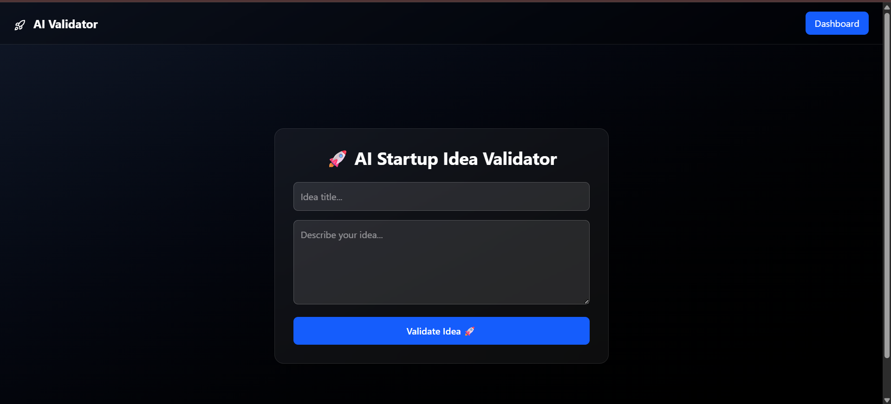
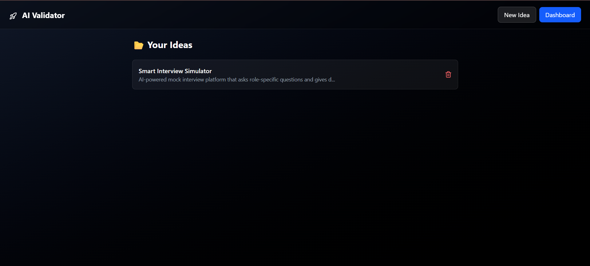
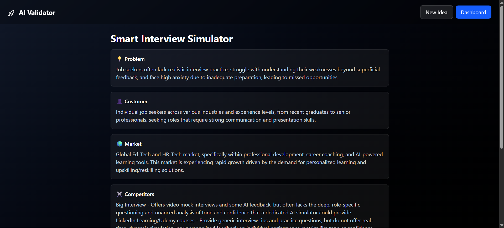

# 🚀 AI Startup Idea Validator
An AI-powered full-stack web application that analyzes startup ideas and generates structured validation reports using LLMs. Built as a complete MVP to simulate real-world startup validation workflows.

---

## 🌐 Live Demo
* 🔗 Frontend: https://ai-powered-startup-idea-validator.vercel.app
* 🔗 Backend: https://ai-poweredstartupideavalidator.onrender.com

---

## Overview
AI Startup Validator helps users evaluate startup ideas using AI-generated insights. Users can submit a startup concept and receive a structured validation report including market analysis, competitor research, profitability scoring, risk assessment, and suggested technologies.
The project was built to explore practical AI integration in modern full-stack applications using the MERN ecosystem and Google Gemini API.

---

## 📸 Screenshots

### Home Page


### Dashboard


### Idea Detail


---

## 🧠 Core Features

### AI-Powered Analysis
* Problem summary generation
* Customer persona identification
* Market overview analysis
* Competitor analysis
* Suggested tech stack generation
* Risk level assessment
* Profitability scoring (0–100)
  
### Dashboard & Reports
* View all submitted startup ideas
* Detailed report pages for each idea
* Structured AI-generated insights
* Delete startup ideas
  
### User Experience
* Responsive UI
* Loading and error states
* Form validation
* Clean report visualization

---

## Engineering Highlights
* Designed a structured AI prompt pipeline with strict JSON response enforcement
* Parsed and validated AI-generated responses before database storage
* Implemented scalable MVC backend architecture
* Built RESTful APIs with centralized async error handling
* Integrated Google Gemini API for dynamic startup analysis generation
* Maintained clean separation of concerns across routes, controllers, services, and models
* Deployed frontend and backend independently using Vercel and Render

---

## 🛠 Tech Stack

### Frontend
* React (Vite)
* Tailwind CSS
* Axios

### Backend
* Node.js
* Express.js

### Database
* MongoDB Atlas
* Mongoose

### AI Integration
* Google Gemini API

### Deployment
* Vercel
* Render

---

## Architecture
**React Frontend** → **Express Backend API** → **Gemini AI Service** → **MongoDB**

---

## API Endpoints
| Method | Endpoint     | Description                                |
| ------ | ------------ | ------------------------------------------ |
| POST   | `/ideas`     | Submit startup idea and generate AI report |
| GET    | `/ideas`     | Fetch all startup ideas                    |
| GET    | `/ideas/:id` | Fetch detailed startup report              |
| DELETE | `/ideas/:id` | Delete startup idea                        |

---

## Example Request

```json
{
  "title": "AI Study Planner",
  "description": "App that creates personalized study plans using AI"
}
```

---

## Example AI response

```json
{
  "problem": "Students struggle to create effective and personalized study schedules.",
  "customer": "College students and competitive exam aspirants",
  "market": "Growing AI-based productivity and edtech market",
  "competitor": [
    "Notion AI",
    "Motion",
    "StudySmarter"
  ],
  "tech_stack": [
    "React",
    "Node.js",
    "MongoDB",
    "Gemini API"
  ],
  "risk_level": "Medium",
  "profitability_score": 78,
  "justification": "Strong market demand with increasing adoption of AI productivity tools."
}
```

---

## Prompt Engineering
The application uses structured prompting to ensure predictable and machine-readable AI outputs

### Prompt Used
You are an expert startup consultant. Analyze the given startup idea and return a structured JSON object with the fields:  

problem  
customer  
market  
competitor  
tech_stack  
risk_level  
profitability_score  
justification  

Rules:
* Keep answers concise and realistic
* competitor should contain exactly 3 competitors
* tech_stack should be 4–6 practical technologies
* profitability_score must be an integer between 0–100
* Return ONLY JSON

---

## Challenges Solved
* Handling inconsistent AI-generated JSON responses
* Parsing and validating LLM outputs reliably
* Designing concise prompts for structured outputs
* Managing asynchronous AI workflows
* Maintaining clean backend architecture for scalability

---

## Project Structure

```
AI_poweredStartupIdeaValidator/
│
├── client/                     # Frontend (React + Vite)
│   ├── public/
│   │   └── Favicon.png
│   │
│   ├── src/
│   │   ├── components/
│   │   │   ├── IdeaCard.jsx
│   │   │   ├── Loader.jsx
│   │   │   ├── Navbar.jsx
│   │   │   └── ReportSection.jsx
│   │   │
│   │   ├── pages/
│   │   │   ├── Dashboard.jsx
│   │   │   ├── Home.jsx
│   │   │   └── IdeaDetail.jsx
│   │   │
│   │   ├── services/
│   │   │   └── api.js
│   │   │
│   │   ├── App.jsx
│   │   ├── main.jsx
│   │   └── index.css
│   │
│   ├── .env
│   ├── .gitignore
│   ├── eslint.config.js
│   ├── index.html
│   ├── package.json
│   ├── package-lock.json
│   ├── vercel.json
│   └── vite.config.js
│
├── server/                     # Backend (Node.js + Express)
│   ├── config/
│   │   └── db.js
│   │
│   ├── controllers/
│   │   └── ideaController.js
│   │
│   ├── middleware/
│   │   └── asyncHandler.js
│   │
│   ├── models/
│   │   └── Idea.js
│   │
│   ├── routes/
│   │   └── ideaRoutes.js
│   │
│   ├── services/
│   │   └── aiService.js
│   │
│   ├── utils/
│   │   └── errorHandler.js
│   │
│   ├── .env
│   ├── index.js
│   ├── package.json
│   └── package-lock.json
│
├── .gitignore
└── README.md
```
---

## Installation & Setup

### 1. Clone the repository
`git` clone https://github.com/Kunal13Kashyap/AI_poweredStartupIdeaValidator.git  
`cd` AI_poweredStartupIdeaValidator

### 2. Setup Backend
`cd` server  
`npm` install

Create a `.env` file inside `/server`:  
PORT=5000  
MONGO_URL=your_mongodb_url  
GEMINI_API_KEY=your_gemini_api_key

Run backend:
`npm` run dev

### 3. Setup Frontend
`cd` client  
`npm` install  
`npm` run dev  

---

## Environment Variables
Create a `.env` file in `/server` using:

```
PORT=5000
MONGO_URL=your_mongodb_url 
GEMINI_API_KEY=your_gemini_api_key
```

---

## Deployment
* Frontend deployed on Vercel
* Backend deployed on Render
* Database hosted on MongoDB Atlas

---

## Future Improvements
* User authentication
* AI response regeneration
* Report export as PDF
* AI response caching
* Search and filter functionality
* Startup analytics dashboard

---

## Author
Kunal Kashyap

---

## License
MIT License
